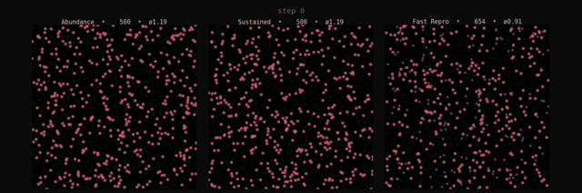
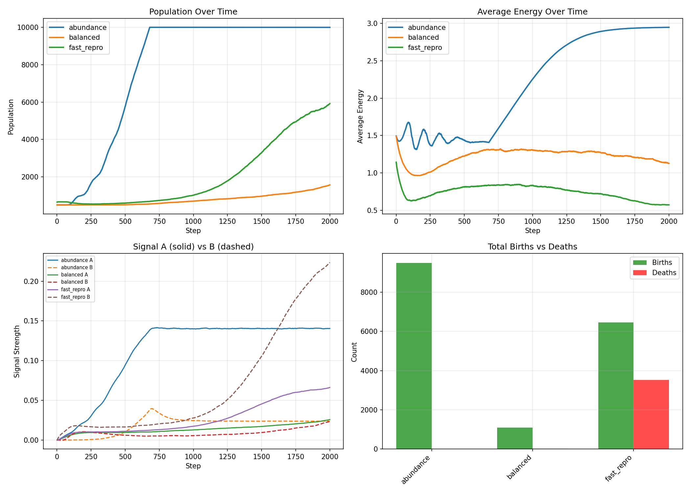

# Nanocolony Lab — Artificial Life Simulation

An artificial life sandbox where thousands of autonomous agents compete for resources, emit signals, and create emergent behaviors like trail-following and panic dynamics.

## Visuals

<div align="center">
  
  <br>
  <em>Three experiments at step 1000: abundance (explosive growth to ~10K), balanced (steady growth to ~800), and fast reproduction (real birth/death turnover at ~2K)</em>
</div>


*Population, energy, signals, and births/deaths across 9 experiments (2000 steps, run_023)*

## Quick Start

```bash
conda env create -f environment.yml
conda activate nanocolony
python main.py
```

**ESC** to quit. Watch the simulation evolve!

## What You're Seeing

| Color | Meaning |
|-------|---------|
| **Green** | Resources (food) - agents consume these to gain energy |
| **Blue** | Signal A - "food trail" pheromone left by agents |
| **Red** | Signal B - "danger" signal from low-energy agents |
| **Bright dots** | High-energy agents (healthy) |
| **Dim dots** | Low-energy agents (struggling) |

## Key Metrics

- **Population**: Number of living agents
- **Births/Deaths**: Per step and cumulative
- **Avg energy**: Health of the population (0 = dead, 3.0 = max)
- **Avg resource**: How much food is available globally
- **Avg signal A/B**: Intensity of communication signals

## Parameters to Tweak (`config.py`)

### Resource Balance
| Parameter | Effect |
|-----------|--------|
| `RESOURCE_SPAWN_RATE` | Higher = more food spawns |
| `RESOURCE_MAX` | Maximum resource value per cell |
| `ENERGY_GAIN_RESOURCE` | How much energy per food consumed |
| `ENERGY_COST_EXIST` | Energy lost per step (higher = harder survival) |

### Reproduction
| Parameter | Effect |
|-----------|--------|
| `ENERGY_REPRO_THRESHOLD` | Energy needed to reproduce (lower = faster growth) |
| `ENERGY_START` | Starting energy for new agents |

### Signals
| Parameter | Effect |
|-----------|--------|
| `SIGNAL_DECAY` | How fast signals fade (lower = shorter trails) |
| `SIGNAL_DIFFUSE_RATE` | How far signals spread |
| `ENERGY_HUNGRY_THRESHOLD` | Energy ratio below which agents follow food trails (Signal A) |
| `SIGNAL_B_METABOLIC_COST` | Energy cost per unit of Signal B at agent position |
| `SIGNAL_B_DEPLETION_EMIT` | Signal B burst emitted when a resource cell is depleted |
| `INITIAL_SIGNAL_B_THRESHOLD` | Default per-agent danger sensitivity (lower = more skittish) |

### World
| Parameter | Effect |
|-----------|--------|
| `INITIAL_AGENTS` | Starting population |
| `WORLD_WIDTH`, `WORLD_HEIGHT` | Map size |

## Example Configurations

### Balanced Ecosystem (Default)
```python
# All defaults from config.py
RESOURCE_SPAWN_RATE = 0.008   # ~2100 cells spawn per step
ENERGY_REPRO_THRESHOLD = 2.0  # energy needed to reproduce
ENERGY_COST_EXIST = 0.002     # per-step survival cost
```
Population grows from 500 to ~1500 over 2000 steps, with sustainable birth/death turnover.

### Explosion (High Resources)
```python
RESOURCE_SPAWN_RATE = 0.014
ENERGY_COST_EXIST = 0.001
ENERGY_COST_MOVE = 0.01
```
Population hits the agent cap (10K), screen floods with agents.

### Collapse (Scarcity)
```python
RESOURCE_SPAWN_RATE = 0.003
ENERGY_COST_EXIST = 0.003
ENERGY_COST_MOVE = 0.02
```
Population dies out by step ~150.

## Conducting Experiments

### Headless Experiment Runner

```bash
python experiment.py --list           # List available experiments
python experiment.py                  # Run all experiments
python experiment.py --experiments food_scarcity  # Run specific experiment
python experiment.py --steps 1000     # Override max steps
```

### 1. Signal Response Experiment
Currently, agents:
- **Follow signal A** when hungry (`energy < ENERGY_HUNGRY_THRESHOLD × trait`), turning toward the strongest trail gradient
- **Avoid signal B** when sensed above their per-agent threshold, turning away
- **Emit signal A** automatically when they eat well (food trails, trait-scaled strength)
- **Emit signal B** on death, when low energy (distress calls), and when they deplete a resource cell
- **Pay a metabolic cost** for standing in signal B zones

Try modifying `agent_logic.py` to change behavior:
- Add more signal types (C = territory, D = food source type)
- Add signal response based on energy level
- Make signal-following the primary behavior

### 2. Evolution Experiment
Track lineage by modifying `agent_state.py`:
- Add `parent_id` to each agent
- Record which genomes survive longer
- Observe if specific behaviors dominate

### 3. Predator Experiment
Add a "predator" agent type:
- Emits strong signal B
- Hunts nearest agent
- Dies if it doesn't eat periodically

### 4. Resource Hotspots
Modify `environment.py` to create:
- Moving food sources (rivers)
- Depleting patches (ore veins)
- Seasonal changes

## Interpreting Results

### Signs of Healthy Ecosystem
- Population fluctuates but stays bounded
- Both births and deaths happening
- Avg energy between 0.8-2.0
- No single signal dominates

### Signs of Problems
- **Population = 0**: Too harsh, no survivors
- **Population at agent cap (10K)**: Resources too generous
- **Signal B dominating**: Mass starvation or death spiral
- **Zero deaths**: No competition — population is below carrying capacity
- **Extinction in <200 steps**: Energy costs exceed resource availability

### Interesting Phenomena to Look For
1. **Food trails**: Signal A follows hungry agents to fresh resource patches
2. **Depletion avoidance**: Signal B from overgrazed cells disperses the herd
3. **Carrying capacity**: Population naturally plateaus when energy balance reaches equilibrium
4. **Turnover dynamics**: Births and deaths coexist in a self-regulating system

## Project Structure

```
nanocolony/
├── main.py              # Entry point
├── config.py            # All tunable parameters
├── experiment.py        # Headless experiment runner
├── world/
│   └── environment.py   # 512x512 grid, resources, signals
├── agents/
│   ├── agent_state.py   # Vectorized agent data
│   └── agent_logic.py   # Sensing and decision logic
├── simulation/
│   └── step.py          # Main simulation loop
└── rendering/
    └── renderer.py      # Pygame visualization
```

## Performance Tips

- Population >50K slows down (Python limitation)
- Rendering samples max 5000 agents for display
- See `ARCHITECTURE.md` for detailed design notes

## Future Enhancements

- Phase 2: Evolution with heritable traits
- Phase 3: Neural network policies
- GPU acceleration with PyTorch/JAX
- 3D extension

## License

MIT
